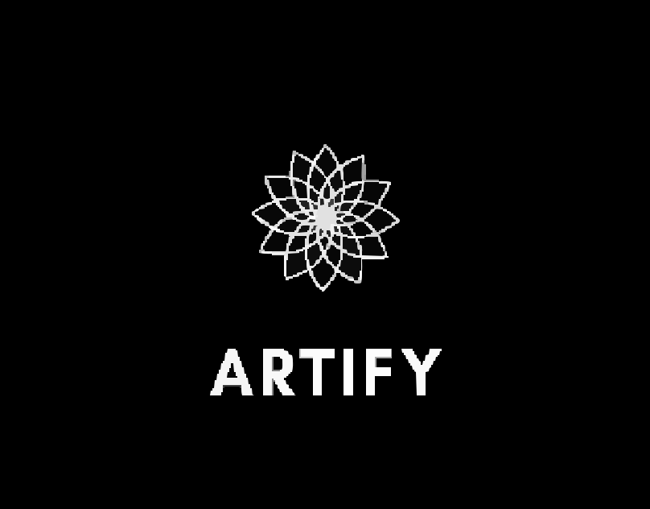

# Artify - Art Auction Platform



## Overview

Artify is a modern online auction platform designed specifically for art enthusiasts. The platform allows artists to showcase and sell their artwork while providing art collectors with a user-friendly interface to discover and bid on unique pieces. With a focus on paintings, sculptures, and crafts, Artify brings the traditional art auction experience to the digital world.

## Features

- **User Authentication**: Secure login and registration system
- **Art Listing**: Artists can list their artwork with descriptions, images, and starting prices
- **Auction System**: Real-time bidding functionality with set end times
- **Categories**: Browse artwork by categories including paintings, sculptures, and crafts
- **Responsive Design**: Optimized viewing experience across various devices

## Tech Stack

- **Frontend**: HTML, CSS, JavaScript
- **Backend**: PHP
- **Database**: MySQL
- **Session Management**: PHP Sessions

## Database Structure

The application uses a MySQL database with the following tables:

- **users**: Stores user account information
- **items**: Contains artwork details including images and auction parameters
- **bids**: Records all bids placed on auction items

## Installation

1. Clone the repository:
   ```
   git clone https://github.com/yourusername/artify.git
   ```

2. Set up a local web server with PHP support (like XAMPP, WAMP, or MAMP)

3. Import the database structure:
   ```
   mysql -u username -p database_name < database.sql
   ```

4. Configure the database connection:
   - Create a `config.php` file in the `php` directory with your database credentials:
   ```php
   <?php
   $host = 'localhost';
   $dbname = 'artify';
   $username = 'your_username';
   $password = 'your_password';

   try {
       $pdo = new PDO("mysql:host=$host;dbname=$dbname", $username, $password);
       $pdo->setAttribute(PDO::ATTR_ERRMODE, PDO::ERRMODE_EXCEPTION);
   } catch (PDOException $e) {
       die("Connection failed: " . $e->getMessage());
   }
   ?>
   ```

5. Create an `images` directory in the root folder and ensure it has write permissions for image uploads

6. Access the application through your local web server

## Usage

### For Artists

1. Create an account or log in
2. Click on "Add to Auction" on the home page
3. Fill out the artwork details including title, description, image, starting price, and auction end time
4. Submit the form to list your artwork

### For Collectors

1. Create an account or log in
2. Browse available artwork by category or view all current auctions
3. Click on an artwork to view details and bidding history
4. Place a bid higher than the current highest bid
5. Receive notifications when you're outbid or when you win an auction

## Directory Structure

```
artify/
├── css/
│   └── style.css
├── images/
│   ├── artifylogo.svg
│   └── [artwork images]
├── js/
│   └── script.js
├── php/
│   ├── add_item.php
│   ├── config.php
│   ├── login.php
│   └── register.php
├── add_item.php
├── auction.php
├── debug_auction.php
├── index.php
├── login-registration.php
└── database.sql
```

## Screenshots

*[Insert screenshots of key pages here]*

## Future Enhancements

- Implementing a search functionality
- Adding user profiles with ratings and reviews
- Integration with payment gateways
- Social media sharing capabilities
- Direct messaging between users
- Featured auctions on the homepage

## Contributing

1. Fork the repository
2. Create your feature branch (`git checkout -b feature/amazing-feature`)
3. Commit your changes (`git commit -m 'Add some amazing feature'`)
4. Push to the branch (`git push origin feature/amazing-feature`)
5. Open a Pull Request

## License

This project is licensed under the MIT License - see the LICENSE file for details.

## Contact

Your Name - [your email]

Project Link: [https://github.com/yourusername/artify](https://github.com/yourusername/artify)

## Acknowledgments

- [Font Awesome](https://fontawesome.com) for icons
- All the artists who inspired this project
